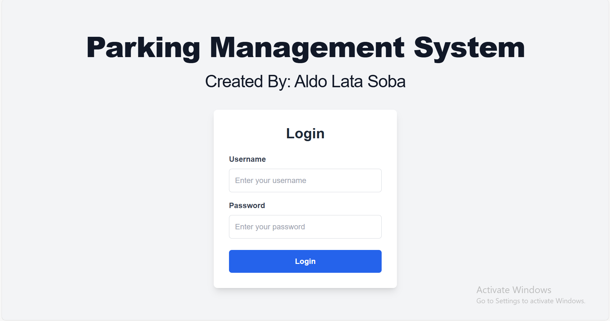
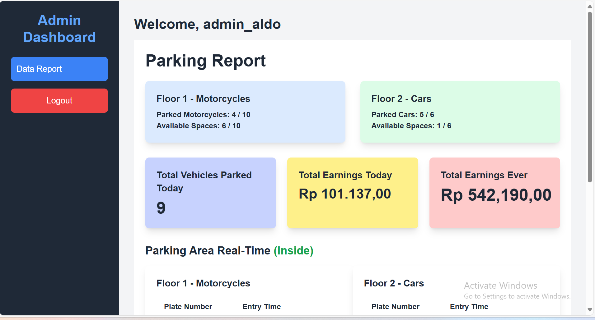
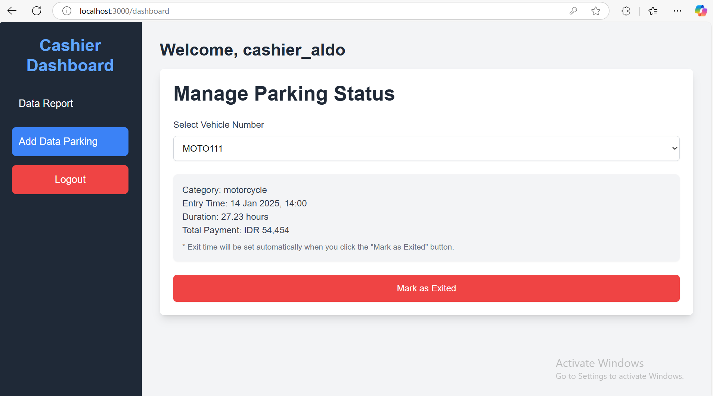
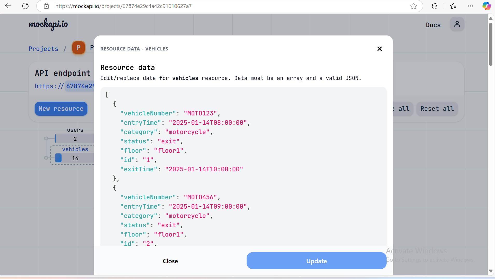

# Parking Management System

A Parking Management System built with **Next.js**, providing an intuitive user interface for managing parking data efficiently. This project includes role-based dashboards, authentication, and more.

# Images / Screenshot of Web Aplication




## Features

- **Admin Dashboard**: Admins can view parking reports and manage system settings.
- **Cashier Dashboard**: Cashiers can manage parking data, add new records, and generate reports.
- **User Authentication**: Secure login for users with role-based access (Admin, Cashier).
- **Vehicles Management**: Vehicle information can be retrieved and managed via a mock API.
- **Responsive Design**: The UI is fully responsive and optimized for both desktop and mobile devices.

## Endpoints Used

The project integrates with the following mock API endpoints:

- **Users Endpoint**: [https://67874e29c4a42c91610627a6.mockapi.io/api/users](https://67874e29c4a42c91610627a6.mockapi.io/api/users)
  - Used for user authentication and role-based access control. It validates users against the stored username and password.
  
- **Vehicles Endpoint**: [https://67874e29c4a42c91610627a6.mockapi.io/api/vehicles](https://67874e29c4a42c91610627a6.mockapi.io/api/vehicles)
  - Used to fetch and manage vehicle data, which includes adding, editing, or deleting vehicle information.

## Getting Started

To get started with the project locally, follow these steps:

### 1. Clone the repository:

```bash
git clone https://github.com/aldoprogrammer/parking-management-system.git
cd parking-management-system
```

### 2. Install the dependencies:
You can install the dependencies using any package manager of your choice:

#### Using npm:
```bash
npm install
```

#### Using yarn:
```bash
Copy code
yarn install
```

#### Using pnpm:
````bash
pnpm install
````


#### 3. Run the development server:
Once the dependencies are installed, run the development server:

#### Using npm:
````bash
npm run dev
````
#### Using yarn:
````bash
yarn dev
````

#### Using pnpm:
````bash
pnpm dev
````

This will start the development server at http://localhost:3000. Open this URL in your browser to view the application.

## Auth Users For Testing
 [
    {
        "username": "admin_aldo",
        "password": "admin_aldo",
        "role": "admin",
        "id": "1"
    },
    {
        "username": "cashier_aldo",
        "password": "cashier_aldo",
        "role": "cashier",
        "id": "2"
    }
]

## Protected Route 
````bash
/dashboard
```` 